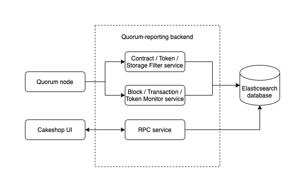

# Quorum Reporting

Quorum Reporting is a tool that indexes blocks and transactions in a Quorum network and generates reports to 
give users insights into what is happening with their contracts.

It generates reports of the contract's state, allowing you to see how the contract changes and evolves
over its lifetime. It will also interpret and parse events that the contract emits so that they can be viewed in a dashboard or other application using the reporting API.

## Usage 

### Pre-requisites

- Running Quorum 2.8.0
    - Quorum needs to be run with GraphQL and websockets open, with `eth`, `admin` and `debug` RPC APIs available.
    - Quorum Reporting fetches a lot of historic data that is pruned by Quorum under default `full` gcmode. It is recommended to run Quorum in `archive` mode.
    
    e.g. `geth --graphql --graphql.vhosts=* --ws --wsport 23000 --wsapi admin,eth,debug --wsorigins=* --gcmode=archive ...`

- ElasticSearch v7 (For Production)
    - Quorum Reporting uses ElasticSearch as its data store.
        [Click here](https://www.elastic.co/guide/en/elasticsearch/reference/current/getting-started.html) to get started with ElasticSearch.

### Up & Running

#### Using Binary

##### Build

```bash
go build [-o quorum-reporting]
```

##### Run

- Running with the default configuration file path of `config.toml`
```bash
./quorum-report
```
- Running with a custom configuration path
```bash
./quorum-report -config <path to config file>
```
- Help command
```bash
./quorum-report -help
```

#### Using Docker

##### Build
```bash
docker build . -t quorum-reporting
```

##### Run

- A configuration must be supplied to the Docker container
```bash
docker run -p <port mapping> --mount type=bind,source=<path to config>,target=/config.toml quorum-reporting:latest
```

### Configuration

A [sample configuration](./config.sample.toml) file has been provided with details about each of the options.

Additionally, application logging verbosity can be controlled with the `-verbosity <level>` flag, where `<level>`
 corresponds to:
```
0: ERROR
1: WARNING
2: INFO
3: DEBUG
```

### Interact with Quorum Reporting through RPC

The application has a set of RPC APIs that are used to interact with the application. See [here](core/rpc/README.md) for all the available RPC APIs.

## Development

### Pre-Requisites

- golang 1.13+

### Development Environment

- Clone the Git repo
```bash
git clone https://github.com/QuorumEngineering/quorum-reporting.git
```
- Fetch dependencies using gomod
```bash
go get ./...
```

## Design

#### Architecture




#### Database Schema

Elasticsearch Database Schema [Reference](database/elasticsearch/README.md)

#### RPC API Specification

[Reference](core/rpc/README.md)
